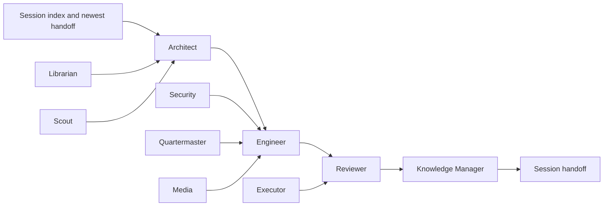

# Agent Architecture

Agents are responsibility profiles, not independent sources of project truth.
All work begins from the same indexes and ends with verification and a session
handoff.

## Rules

1. The [Librarian](../Agents/Librarian/Role.md) searches before creation.
2. The [Architect](../Agents/Architect/Role.md) records material decisions.
3. The [Engineer](../Agents/Engineer/Role.md) changes only authorized scope.
4. The [Reviewer](../Agents/Reviewer/Role.md) verifies links, tests, and risks.
5. The [Knowledge Manager](../Agents/KnowledgeManager/Role.md) updates indexes
   and handoffs.
6. The [Executor](../Agents/Executor/Role.md) never expands authority or bypasses
   project safety boundaries.

The complete role registry is in the [agent index](../Agents/README.md).
