# BoxBrain Connection Lifecycle

BoxBrain is the Raspberry Pi 4 appliance. On power or attachment it inventories
every supported transport, establishes only authorized channels, records the
capabilities each channel actually proves, runs a bounded health assessment,
and retains enough target identity and history to support a later explicitly
enrolled remote repair.

```mermaid
flowchart LR
    DETECT["Power or attachment detected"]
    INVENTORY["Inventory USB, Ethernet, Wi-Fi, Bluetooth, and near field"]
    TRUST["Verify target identity and transport authorization"]
    MAP["Publish connection and capability map"]
    COLLECT["Collect bounded system health evidence"]
    REDACT["Redact secrets and minimize evidence"]
    ASSESS["GPT-assisted repair assessment"]
    OPERATE["Operator-approved repair operations"]
    LOG["Append-only connection, assessment, and operation log"]
    REMOTE["Optional explicit remote enrollment"]

    DETECT --> INVENTORY --> TRUST --> MAP
    MAP --> COLLECT --> REDACT --> ASSESS --> OPERATE --> LOG
    LOG --> REMOTE
    REMOTE -. future authorized session .-> TRUST
```

## Lifecycle

1. **Connect:** inventory every adapter and link without extracting credentials
   or pairing with an unknown device. Physical presence is evidence of
   attachment, not blanket authorization.
2. **Map:** publish each transport separately, including interface, link state,
   target count, and capability state. Capabilities are observed, not inferred.
3. **Assess:** collect a bounded machine inventory through the strongest proven
   channel. Sanitize it before a model receives the repair-assessment request.
4. **Operate:** show proposed work in the console. Input, shell, file, audio, and
   video actions remain independently gated by target and policy.
5. **Retain:** append connection, identity, assessment, approval, operation, and
   result events. Future remote access exists only after explicit enrollment.

## Transport roles

| Transport | Dashboard path | Target path | Typical capabilities | Important boundary |
| --- | --- | --- | --- | --- |
| USB / USB-C | HTTPS/WebSocket over `usb0` | RNDIS plus separate keyboard and mouse HID | dashboard, data, bounded SSH/PowerShell, keyboard, mouse | Gadget migration is staged; HID input still needs operation approval |
| Ethernet | HTTPS/WebSocket over private IP | Authorized IP protocols | dashboard, data, SSH, bounded PowerShell/CMD; later RDP video/input | Private reachability does not authorize a target |
| Wi-Fi | HTTPS/WebSocket over private IP or approved AP/client mode | Authorized IP protocols | same IP capabilities as Ethernet | Discovery may be automatic; credential retrieval is separate and explicit |
| Bluetooth | Future PAN for dashboard/data | Future HID or approved profile | pairing-gated keyboard/mouse; optional PAN/data/audio profiles | USB insertion cannot silently approve Bluetooth pairing |
| Near field / NFC | Handoff to another transport | Identity or onboarding record | small onboarding payload only | Not a repair-session, video, audio, shell, keyboard, or mouse carrier |

Additional adapters use the same plugin contract. Hardware presence alone must
never create an invented capability.

## Connection-map contract

Every transport reports one of `connected`, `available`, or `not-detected`.
Every capability reports one of:

- `ready`: the channel is observed and usable within its existing policy;
- `available`: the physical endpoint exists but an operation still needs approval;
- `bounded`: only the fixed diagnostic subset is enabled;
- `requires-authorization`: target enrollment is missing;
- `requires-pairing`: Bluetooth trust is missing;
- `not-configured`: hardware or a network may exist, but the profile is disabled;
- `unsupported`: the transport cannot carry that capability.

Initial capabilities are dashboard, onboarding, keyboard, mouse, SSH,
PowerShell, CMD, data, video, and audio. Future capabilities extend the list
without changing the state meanings.

## Health-assessment boundary

The collector should prefer structured local facts: operating system, hardware,
drivers, service state, storage, memory, temperature, network adapters, update
state, and bounded diagnostic findings. Passwords, Wi-Fi keys, private keys,
browser data, tokens, and unrelated user content are excluded. The model returns
an assessment and repair proposals; it does not silently execute them.

## Remote-only continuation

A future remote repair is allowed only after BoxBrain records a durable target
identity, an operator-approved remote enrollment, a restricted target agent or
tunnel, and its authentication material outside logs. Connection history can
help select the channel but cannot recreate access that was never enrolled.
Revocation, expiry, and emergency stop remain available from the BoxBrain
console.
