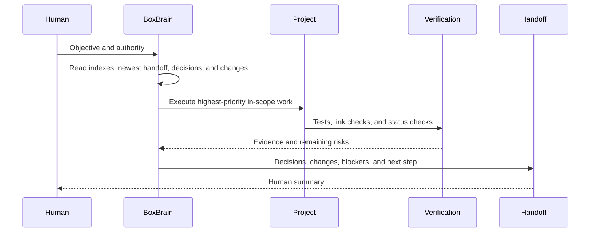

# Knowledge and Execution Data Flow

## Repository update order

1. Read [Repository Index](../Admin/RepositoryIndex.md).
2. Read the newest entry in [Session Index](../Admin/SessionIndex.md).
3. Read [Decision Index](../Admin/Decisions.md) and
   [Change Index](../Admin/ChangeLog.md).
4. Update [Master TODO](../Admin/MasterTODO.md).
5. Work in the registered implementation repository.
6. Verify that repository.
7. Update the project index and BoxBrain cross-project records.
8. Create the next session bundle.

Detailed code-level data flow remains in each project’s canonical
documentation.

## Current BrainConnect control flow

1. The operator selects the enabled disposable VM and creates an `open` task.
2. The dashboard submits a bounded typed operation.
3. The controller transactionally rechecks emergency stop, task state, target
   state, policy, and the 500-operation limit.
4. The operation is stored as `queued`; the audit event records type, size,
   digest, target, and task without copying sensitive content.
5. A future out-of-process adapter will execute only against the exact VM,
   return bounded evidence, and restore the clean checkpoint after experiments.
