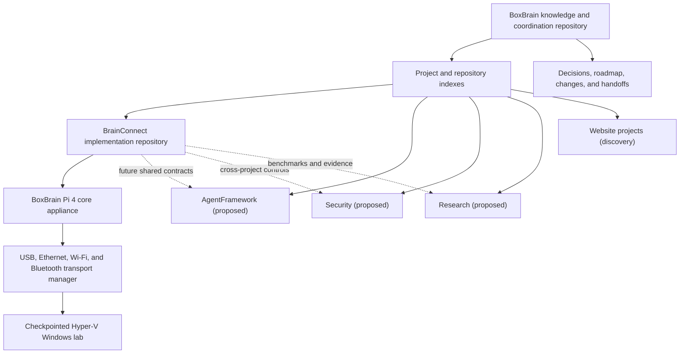

# System Architecture

BoxBrain is the Raspberry Pi 4 appliance: its durable controller, local state,
transport manager, and recovery interfaces live on the Pi. This repository is
the appliance's source and ecosystem knowledge base. BrainConnect supplies the
audited controller components that BoxBrain embeds rather than defining a
second physical controller.

## Execution logic

Every BoxBrain/Aurum component, agent, build loop, deployment, diagnostic, and
automation follows the [state-first execution policy](ExecutionLogic.md):
identify the requested outcome, observe current state, define the required state
delta and constraints, choose the minimum useful action that can change that
state or produce new evidence, and verify the resulting state. Repeated work
without changed state/evidence is not progress.

Future Branch is enforced as a pre-execution gate by the
[Future Branch Execution Gate](FutureBranchExecutionGate.md): advance safe,
reversible tool-side success, failure, rollback, dependency, and verification
branches before handing the operator the smallest remaining physical action.

## Boundaries

- BoxBrain owns cross-project discovery, dependencies, priorities, decisions,
  and handoffs.
- The Pi 4 is the canonical BoxBrain runtime identity and owns durable local
  state plus all physical transport endpoints.
- USB attachment may expose USB Ethernet plus keyboard and mouse HID. Bluetooth
  HID remains a separate pairing and trust boundary even when USB attachment is
  used as its trigger.
- Live USB keyboard and mouse reports are owned by a root-only broker with
  explicit HID device access. The unprivileged BoxBrain web service reaches it
  through a group-restricted Unix socket; the existing SSH-tunneled Pi console
  proxies the CSRF-protected control page. Browser blur, page hiding, an
  operator release, or two seconds of inactivity releases every key and mouse
  button. Audits record event metadata but never typed text.
- Typed HID input defaults to acknowledged single-character operations. The
  controller waits for the Pi broker to confirm each USB report pair before it
  sends the next character. Operator choices use concise single-letter input
  where the called workflow supports it; existing authorization gates keep
  their established meaning.
- Each registered repository owns its code, tests, and detailed technical
  documentation.
- A planned project receives only a project index until source or requirements
  are discovered.
- Links replace copied documents.

## Current dependency path

The active execution path is the BoxBrain Pi appliance, using BrainConnect
controller components, to an authorized target over a bounded transport. The
current deployed Pi service remains an edge/controller bridge while the
remaining controller state and UI are consolidated onto the appliance.
BrainConnect has
verified and audited the full target's certificate-only RDP identity boundary;
it now accepts bounded, audited open-profile operations into a durable queue.
It also has a disabled-by-default out-of-process protocol, exact certificate
recheck, durable execution states, bounded result metadata, and deterministic
no-action fixture. The native transport connector now supports
certificate-pinned pointer movement, Unicode text, fixed allowlisted key
events, and bounded multi-step keyboard sequences in one connection. Its
amd64 and arm64 artifacts are verified, and the sequence-capable arm64
artifact is installed on the Pi. Windows event evidence proved exact-user
authentication and reconnection to the intended console session. Slow-path
keyboard delivery then independently launched Task Manager and Notepad.
Bounded frame evidence verified visible text and an absolute pointer click by
showing a later keyboard marker at the clicked caret position. The Pi is inert
again with execution disabled, no drop-in, no encrypted target credentials,
and no temporary runner; the VM is restored to rotated clean checkpoint
`clean-linked-rotated-2026-07-29`. Shell, scrolling, clipboard, and generalized
per-action verification remain pending.

See [BrainConnect’s canonical architecture](https://github.com/FormatX66/BrainConnect/blob/main/docs/ARCHITECTURE.md)
for component-level details and [Integrations](Integrations.md) for registered
boundaries. The appliance's canonical connect-assess-operate-retain path is in
[Connection Lifecycle](ConnectionLifecycle.md).
