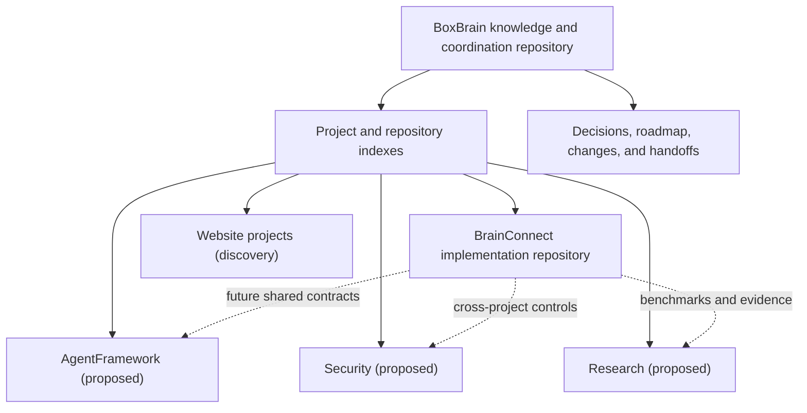

# System Architecture

BoxBrain separates ecosystem knowledge from implementation source while making
both discoverable from one index.

## Boundaries

- BoxBrain owns cross-project discovery, dependencies, priorities, decisions,
  and handoffs.
- Each registered repository owns its code, tests, and detailed technical
  documentation.
- A planned project receives only a project index until source or requirements
  are discovered.
- Links replace copied documents.

## Current dependency path

The active execution path is BoxBrain governance → BrainConnect repository →
Flutter UI and FastAPI controller → future observation-only target plugin.

See [BrainConnect’s canonical architecture](../../BrainConnect/docs/ARCHITECTURE.md)
for component-level details and [Integrations](Integrations.md) for registered
boundaries.
