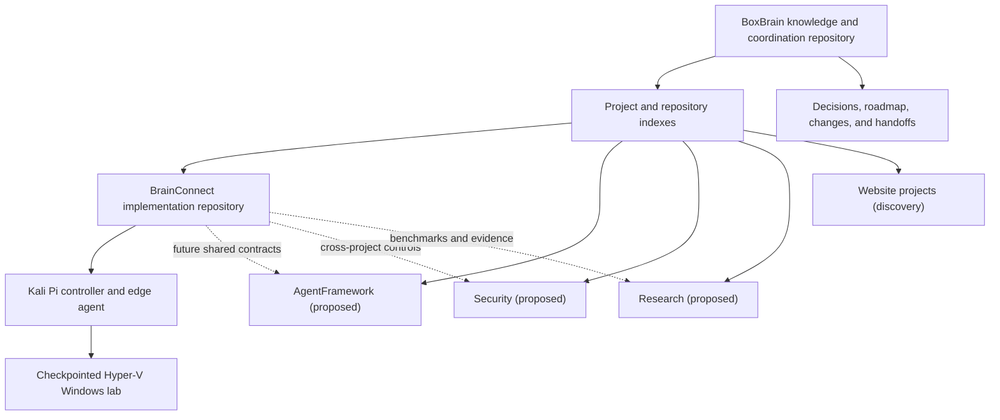

# System Architecture

BoxBrain separates ecosystem knowledge from implementation source while making
both discoverable from one index.

## Boundaries

- BoxBrain owns cross-project discovery, dependencies, priorities, decisions,
  and handoffs.
- Each registered repository owns its code, tests, and detailed technical
  documentation.
- A planned project receives only a project index until source or requirements
  are discovered.
- Links replace copied documents.

## Current dependency path

The active execution path is BoxBrain governance to the BrainConnect
repository, then to the USB-bound Kali Pi controller and edge agent, and then
to the checkpointed Windows lab on the Pi-only network. BrainConnect has
verified and audited the full target's certificate-only RDP identity boundary;
it now accepts bounded, audited open-profile operations into a durable queue.
It also has a disabled-by-default out-of-process protocol, exact certificate
recheck, durable execution states, bounded result metadata, and deterministic
no-action fixture. The first native transport connector now supports
certificate-pinned pointer movement, Unicode text, and fixed allowlisted key
or chord events. Its amd64 and arm64 artifacts are verified, and the arm64
artifact is installed on the Pi. A bounded live run proved exact-target
authentication and FreeRDP event submission. The Pi is now inert again with
execution disabled, no execution drop-in, and no encrypted target credentials.
The next active step is a bounded persistent input session plus independent
frame or guest-state verification. Observation-only frame delivery remains a
parallel pending track.

See [BrainConnect’s canonical architecture](../../BrainConnect/docs/ARCHITECTURE.md)
for component-level details and [Integrations](Integrations.md) for registered
boundaries.
